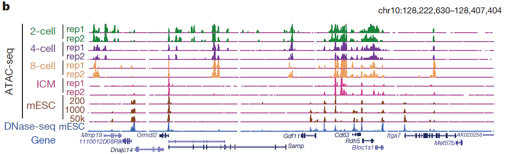
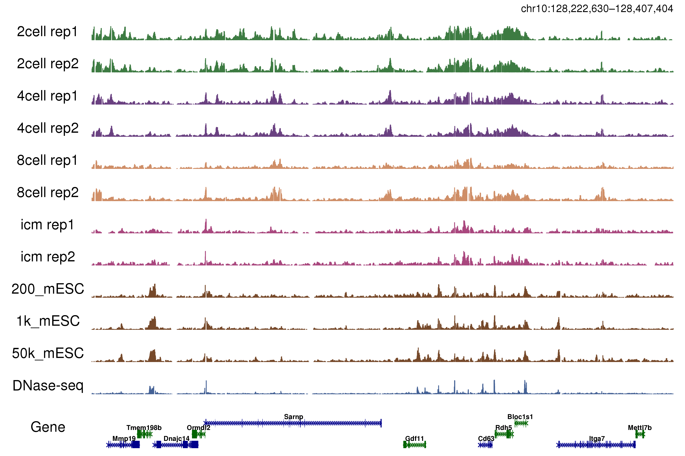
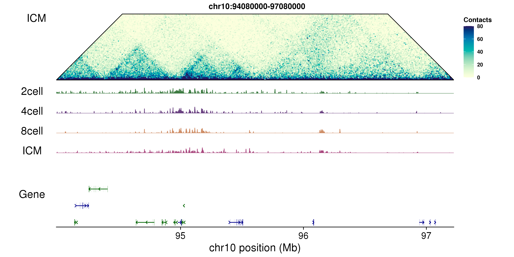

# Visualize Epigenome Track by R

Aim: To aovid tedious decorate Epigenome Track by IGV + Adobe Illustrator

The function `myGenePlot()` and `myBigwigTrack()` were apapted by the function `AnnotationPlot()` and `BigwigTrack()` in R package `Signac`(version 1.4.0)


## Basic Usage

### 1. plot gene track

```R
library(ggplot2)
source("myfunction.R")
p_gene <- myGenePlot(annotation = mm9.tx,
                     region = tmp.region,
                     arrow_sbreaks = 600,
                     font_size = 18,
                     label_size = 3)
p_gene

```

For example

```R
library(ggplot2)
library(patchwork)
library(cowplot)
library(tidyverse)
library(GEOquery)
library(GenomicRanges)
library(GenomicFeatures)
library(org.Mm.eg.db)
library(TxDb.Mmusculus.UCSC.mm9.knownGene)
library(clusterProfiler)
library(future.apply)
library(rtracklayer)
library(GENOVA)
library(sigminer)
library(RColorBrewer)
source("myfunction_lib.R")

###---plot gene---
mm9 <- TxDb.Mmusculus.UCSC.mm9.knownGene
mm9.tx <- myGetGRangesFromsTxDb(txdb = mm9,
                                standard.chromosomes = T,
                                verbose = T)
tmp <- bitr(mm9.tx$gene_id,
            fromType = "ENTREZID",
            toType = "SYMBOL",
            OrgDb = org.Mm.eg.db)
tmp <- tmp[!duplicated(tmp$SYMBOL),]
ttt.mm9.tx <- mm9.tx[mm9.tx$gene_id %in% tmp$ENTREZID]
ttt.mm9.tx$gene_id <- plyr::mapvalues(ttt.mm9.tx$gene_id,
                                      from = tmp$ENTREZID,
                                      to = tmp$SYMBOL)
mm9.tx <- ttt.mm9.tx

tmp.region <- "chr10:128222630-128407404"
p_gene <- myGenePlot(annotation = mm9.tx,
                     region = tmp.region,
                     arrow_sbreaks = 600,
                     font_size = 18,
                     label_size = 3)+
  ylab("Gene")+
  theme(plot.margin = unit(c(0,0,0,0), "cm"),
        axis.title.y = element_text(angle = 0,vjust = 0.5,hjust = 0.5),
        axis.line = element_line(size = 1),
        axis.ticks = element_line(size = 1))
p_gene
```
### 2. BigWig Track

```R
source("myfunction_lib.R")
myBigwigTrack(region = as(tmp.region,"GRanges"),
                         bigwig = tmp.files,
                         smooth = 100,
                         lognorm = F,
                         type = "bar",
                         y_label = tmp.levels,
                         fontsize=18,
                         track.color=tmp.colors,
                         tmp.ylimits=c(0,100),
                         max.downsample = 3000,
                         downsample.rate = 0.1,
                         tmp.seed=42)
```

For example, you can visulize a DNaseI-seq signal 

```R
tmp.files <- "data/ENCODE_mESC_DNaseI.bw"
tmp.colors <- "#446195"
tmp.levels <- "DNase-seq"
p_DNase <- myBigwigTrack(region = as(tmp.region,"GRanges"),
                         bigwig = tmp.files,
                         smooth = 100,
                         lognorm = F,
                         type = "bar",
                         y_label = tmp.levels,
                         fontsize=18,
                         track.color=tmp.colors,
                         tmp.ylimits=c(0,100),
                         max.downsample = 3000,
                         downsample.rate = 0.1,
                         tmp.seed=42)
p_DNase
```
If you don't have `bigwig` file, but you have `bedgraph` file, you can read bedgraph file and export it as bigwig by function 

```R
source("myfunction_lib.R")
myBegraphToBigwig(tmp.input = tmp.files,
                    tmp.output = tmp.output,
                    region = NULL,
                    tmp.seqlength = seqlengths(mm9.tx),
                    tmp.levels = seqlevels(mm9.tx))
```

to see more details you can visit my post here[] or read code in `script.R`

## Combine multiple track together

You can use `patchwork` to combine these `ggplot2` object together. Details can see the following cases

### 1. ATAC-seq track

In `script.R`, we replicate Figure 1b in the article `The landscape of accessible chromatin in mammalian preimplantation embryos` published in nature, 2016.





### 2. Plot hic track

In `script.R`, we use `pyramid` function in R package `GENOVA` to plot the following hic heatmap.




